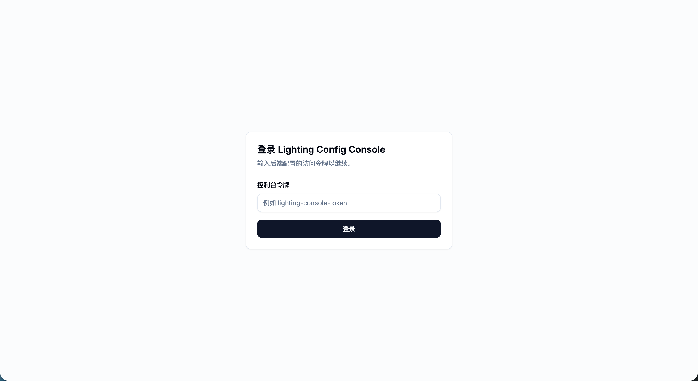
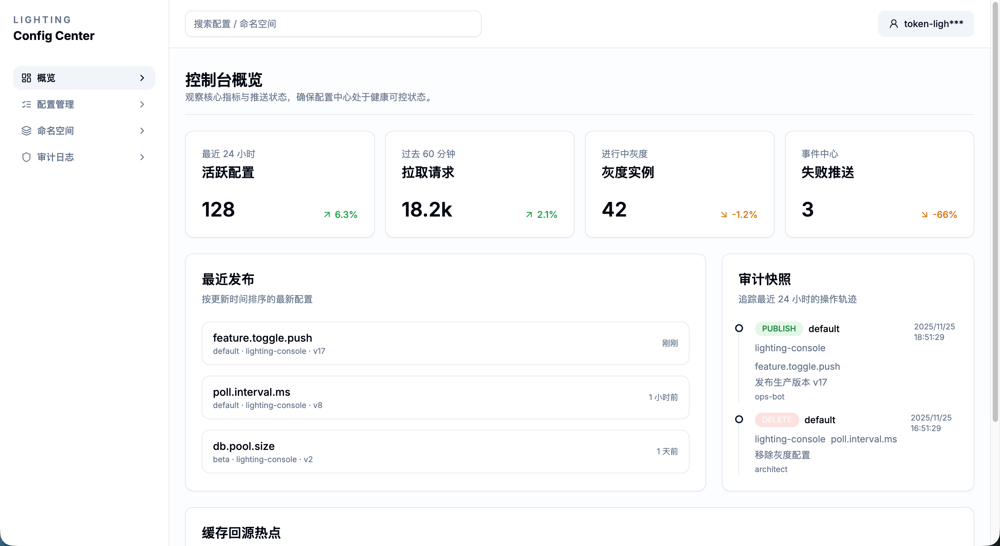
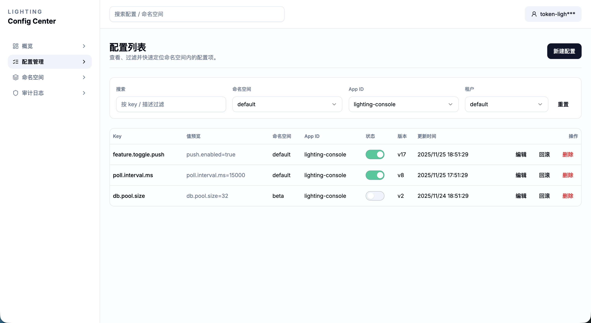
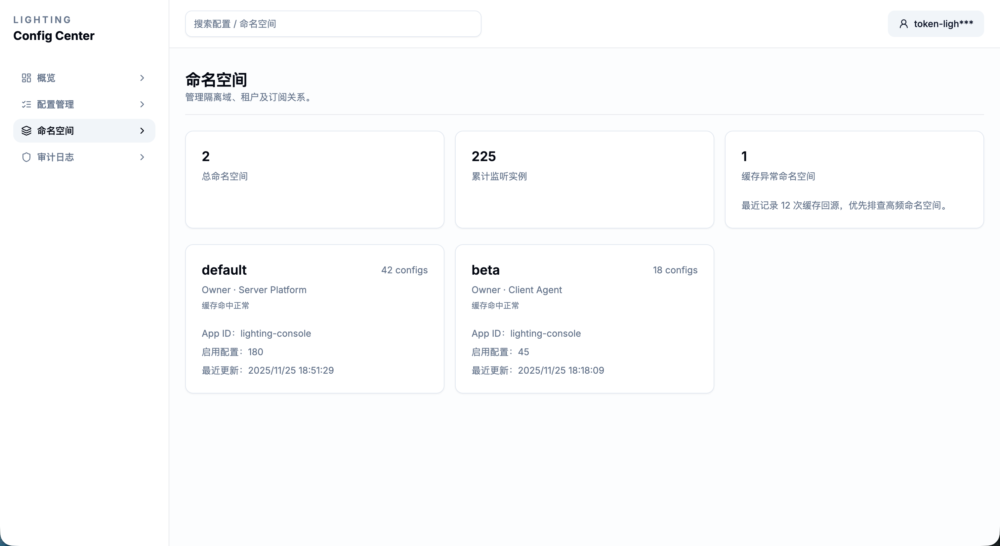
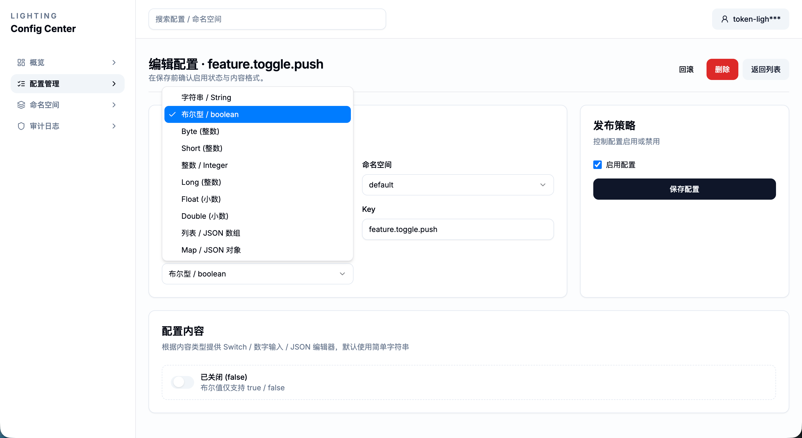
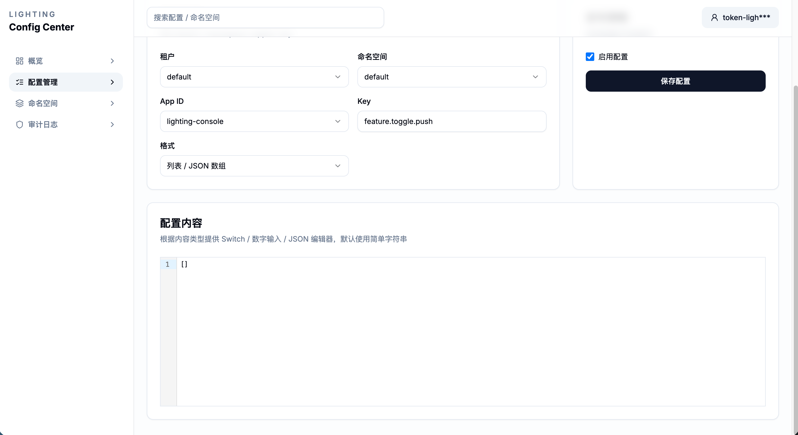
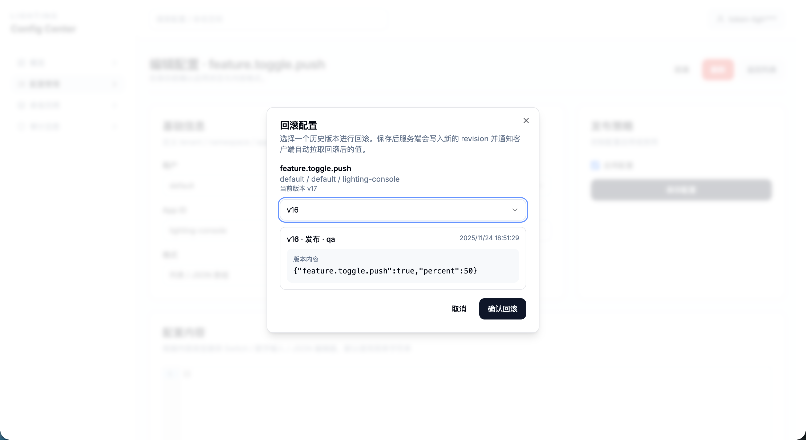

# lighting-config

[English](README.en.md) | [简体中文](README.md)

[](https://central.sonatype.com/artifact/pub.lighting/lighting-config-spring-boot-starter)


Lightweight configuration center for Java services. Two modes: standalone server and embedded in-process. Uses HTTP long-polling + local cache, RDBMS as the source of truth (Caffeine as hot cache), SPI-friendly, with built-in security and observability.

## Features
- Dual mode: standalone server (`lighting-config-server`) or embedded (`lighting-config-embedded`).
- Efficient delivery: HTTP long-poll + versioning; Caffeine cache for ms-level refresh.
- Reliable storage: JDBC by default (MySQL/PostgreSQL/Oracle) with dialect scripts and cache invalidation.
- Extensible: protocols/models live in `lighting-config-core`; storage/auth/gray release via SPI.
- Security & observability: token/JWT, tenant/namespace isolation, metrics & health checks.
- Ecosystem: pure Java SDK, Spring Boot 3 starter, samples, and planned web console.

## Modules
- `lighting-config-core`: domain models, DTOs, SPI (no Spring dependency).
- `lighting-config-server`: Spring Boot server; HTTP poll + admin APIs.
- `lighting-config-client`: generic client SDK (polling, cache, listeners).
- `lighting-config-spring-boot-starter`: Spring Boot 3 auto configuration.
- `lighting-config-embedded`: run config center inside your JVM.
- `lighting-config-example/*`: samples (embedded / standalone server / client).
- `lighting-config-console`: console (see `docs/frontend-architecture.md`).

## Quick start
Prereqs: JDK 17, Maven 3.8+. For standalone mode prepare MySQL/PG/Oracle. Latest version is in the badge (examples use `1.0.1`).

### 1) Run the server
`application.yml` (PostgreSQL sample; swap to MySQL/Oracle as needed):

```yaml
spring:
  datasource:
    url: jdbc:postgresql://localhost:5432/lighting_config
    username: lighting
    password: lighting
lighting:
  config:
    mode: standalone
    server:
      port: 7086
    storage:
      type: jdbc
    auth:
      enabled: true
      mode: token
      options:
        tokens: ${LIGHTING_CONSOLE_TOKENS:lighting-console-token}
```

Start and open API docs:

```bash
mvn -pl lighting-config-server -am spring-boot:run
open http://localhost:7086/lighting-config/api/docs
```

Default token: `lighting-console-token` (`X-Lighting-Token` or `Authorization: Bearer <token>`). DDLs in `docs/schema/`; server settings in `docs/server-configuration.md`.

Write a sample config (clients will poll it):

```bash
curl -XPOST http://localhost:7086/lighting-config/api/admin/config \
  -H 'Content-Type: application/json' \
  -H 'X-Lighting-Token: lighting-console-token' \
  -d '{"tenant":"default","namespace":"default","appId":"demo-client","key":"feature.order.v2","value":"true","contentType":"STRING"}'
```

Console: `http://<host>:<port>/lighting-config/index.html` (e.g., `http://localhost:7086/lighting-config/index.html`), use the same token.

## Integration recipes
### Spring Boot Starter (recommended)
Add dependency (replace with the latest version if needed):

```xml
<dependency>
  <groupId>pub.lighting</groupId>
  <artifactId>lighting-config-spring-boot-starter</artifactId>
  <version>1.0.1</version>
</dependency>
```

Configure scope and server:

```yaml
lighting:
  config:
    client:
      server:
        address: http://localhost:7086
      tenant: default
      namespace: default
      app-id: demo-client
      poll-interval: 15s
      auth-token: lighting-console-token
```

Use annotations:

```java
@RestController
class FeatureController {
  @LightingValue(key = "feature.order.v2", defaultValue = "false")
  private boolean orderV2Enabled;

  @LightingListener(prefix = "feature.")
  public void onFeatureChanged(ConfigChange change) {
    log.info("feature changed: {} -> {}", change.getCoordinate().getKey(), change.getValue());
  }

  @GetMapping("/feature/order")
  public boolean orderV2() {
    return orderV2Enabled;
  }
}
```

### Pure Java SDK (non-Spring)
Dependency:

```xml
<dependency>
  <groupId>pub.lighting</groupId>
  <artifactId>lighting-config-client</artifactId>
  <version>1.0.1</version>
</dependency>
```

Usage:

```java
ClientOptions options = ClientOptions.builder()
    .serverAddress("http://localhost:7086")
    .tenant("default")
    .namespace("default")
    .appId("demo-client")
    .pollInterval(Duration.ofSeconds(10))
    .authToken("lighting-console-token")
    .build();

LightingClient client = new LightingClient(options, new HttpPollingTransport(options));
client.addListener("feature.", change -> System.out.println("updated: " + change.getValue()));
client.start();

String feature = client.get("feature.order.v2").orElse("false");
System.out.println("flag=" + feature);
```

### Embedded mode (no external server)
Dependency:

```xml
<dependency>
  <groupId>pub.lighting</groupId>
  <artifactId>lighting-config-embedded</artifactId>
  <version>1.0.1</version>
</dependency>
```

Use `EmbeddedConfigManager` to host config inside your process (great for edge/single-node). See `lighting-config-example-embedded` for a runnable sample.

## Samples
- Embedded: `cd lighting-config-example/lighting-config-example-embedded && mvn spring-boot:run`
- Lightweight server: `cd lighting-config-example/lighting-config-example-standalone && mvn spring-boot:run`
- Spring Boot client: `cd lighting-config-example/lighting-config-example-client && mvn spring-boot:run`

## Docs
- Design baseline: `docs/系统设计文档.md`
- Console plan: `docs/frontend-architecture.md`
- Client settings: `docs/client-configuration.md`
- Server settings: `docs/server-configuration.md`
- Examples: `docs/example.md`

## Build & test
- Full build: `mvn clean verify`
- Skip tests: `mvn -DskipTests install`
- Baseline: JDK 17, Spring Boot 3.2.x

## Screenshots
Console samples (more in `docs/screenshots/`):









## License
Apache License 2.0 (see `LICENSE`).
