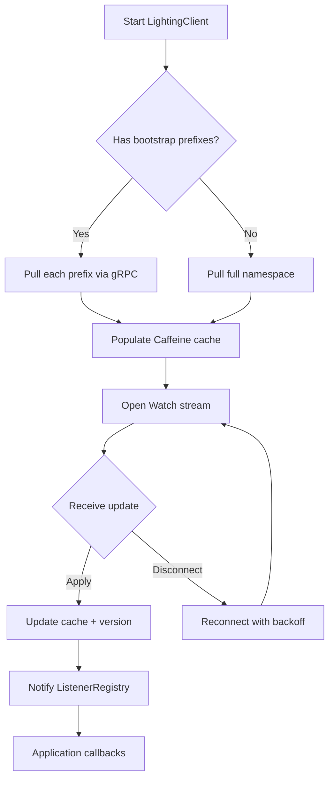

# Client 模块流程

```mermaid
flowchart TD
    A[Start LightingClient] --> B{Has bootstrap prefixes?}
    B -- Yes --> C[Pull each prefix via gRPC]
    B -- No --> D[Pull full namespace]
    C --> E[Populate Caffeine cache]
    D --> E
    E --> F[Open Watch stream]
    F --> G{Receive update}
    G -->|Apply| H[Update cache + version]
    H --> I[Notify ListenerRegistry]
    I --> J[Application callbacks]
    G -->|Disconnect| K[Reconnect with backoff]
    K --> F
```
