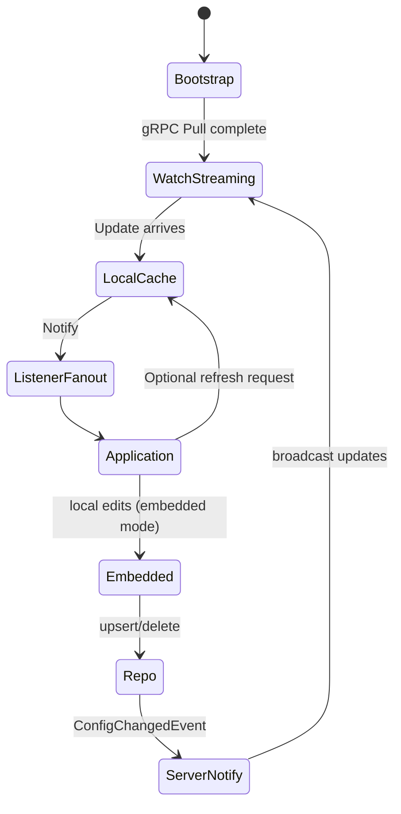

# 通信机制 & 流程

```mermaid
stateDiagram-v2
    [*] --> Bootstrap
    Bootstrap --> WatchStreaming: gRPC Pull complete
    WatchStreaming --> LocalCache: Update arrives
    LocalCache --> ListenerFanout: Notify
    ListenerFanout --> Application
    Application --> LocalCache: Optional refresh request
    Application --> Embedded: local edits (embedded mode)
    Embedded --> Repo: upsert/delete
    Repo --> ServerNotify: ConfigChangedEvent
    ServerNotify --> WatchStreaming: broadcast updates
```
