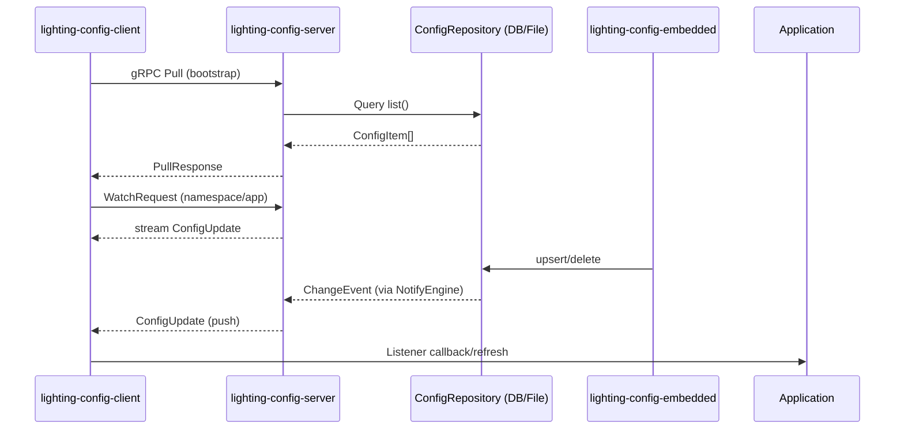

# 跨模块时序图

```mermaid
sequenceDiagram
    participant Client as lighting-config-client
    participant Server as lighting-config-server
    participant Repo as ConfigRepository (DB/File)
    participant Embedded as lighting-config-embedded

    Client->>Server: gRPC Pull (bootstrap)
    Server->>Repo: Query list()
    Repo-->>Server: ConfigItem[]
    Server-->>Client: PullResponse
    Client->>Server: WatchRequest (namespace/app)
    Server-->>Client: stream ConfigUpdate
    Embedded->>Repo: upsert/delete
    Repo-->>Server: ChangeEvent (via NotifyEngine)
    Server-->>Client: ConfigUpdate (push)
    Client->>Application: Listener callback/refresh
```
