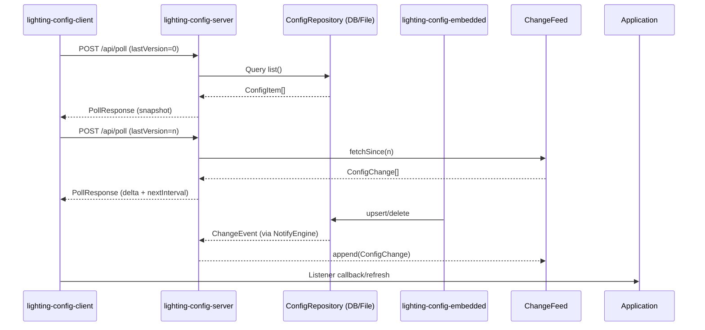

# 跨模块时序图

```mermaid
sequenceDiagram
    participant Client as lighting-config-client
    participant Server as lighting-config-server
    participant Repo as ConfigRepository (DB/File)
    participant Embedded as lighting-config-embedded

    Client->>Server: POST /api/poll (lastVersion=0)
    Server->>Repo: Query list()
    Repo-->>Server: ConfigItem[]
    Server-->>Client: PollResponse (snapshot)
    Client->>Server: POST /api/poll (lastVersion=n)
    Server->>ChangeFeed: fetchSince(n)
    ChangeFeed-->>Server: ConfigChange[]
    Server-->>Client: PollResponse (delta + nextInterval)
    Embedded->>Repo: upsert/delete
    Repo-->>Server: ChangeEvent (via NotifyEngine)
    Server-->>ChangeFeed: append(ConfigChange)
    Client->>Application: Listener callback/refresh
```
