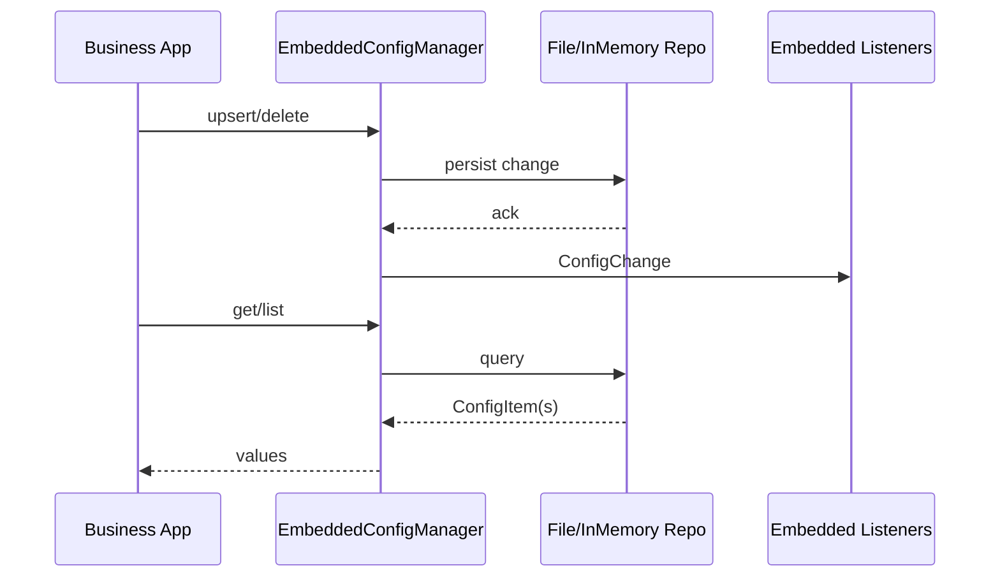

# Embedded 流程

```mermaid
sequenceDiagram
    participant App as Business App
    participant Embedded as EmbeddedConfigManager
    participant Repo as File/InMemory Repo
    participant Listeners as Embedded Listeners

    App->>Embedded: upsert/delete
    Embedded->>Repo: persist change
    Repo-->>Embedded: ack
    Embedded->>Listeners: ConfigChange
    App->>Embedded: get/list
    Embedded->>Repo: query
    Repo-->>Embedded: ConfigItem(s)
    Embedded-->>App: values
```
