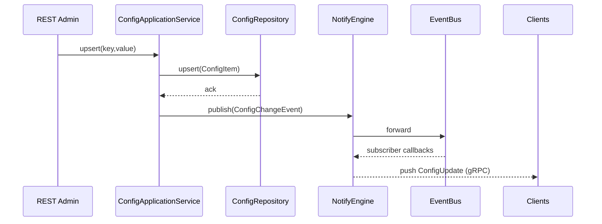

# Server 模块时序

```mermaid
sequenceDiagram
    participant AdminAPI as REST Admin
    participant Service as ConfigApplicationService
    participant Repo as ConfigRepository
    participant Notify as NotifyEngine
    participant EventBus as EventBus

    AdminAPI->>Service: upsert(key,value)
    Service->>Repo: upsert(ConfigItem)
    Repo-->>Service: ack
    Service->>Notify: publish(ConfigChangeEvent)
    Notify->>EventBus: forward
    EventBus-->>Notify: subscriber callbacks
    Notify-->>Clients: push ConfigUpdate (gRPC)
```
